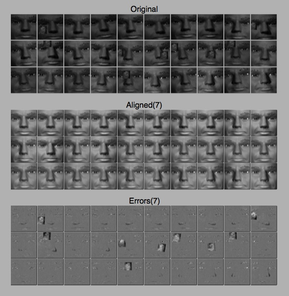

rasl
====
[![Build Status][travis-image]][travis-url] [![PyPI version][pypi-image]][pypi-url] [![PyPI download][download-image]][pypi-url]

Align cropped facial images varying in illumination, pose, and occlusions.

`rasl` is a python implementation of the batch image alignment technique
described in:

Y. Peng, A. Ganesh, J. Wright, W. Xu, Y. Ma, "Robust Alignment by
   Sparse and Low-rank Decomposition for Linearly Correlated Images",
   IEEE Transactions on Pattern Analysis and Machine Intelligence (PAMI) 2011

The paper describes a technique for aligning facial images having
variation in illumination and pose, and with occlusions such as
eyeglasses or hair. RASL seeks transformations or deformations that
will best superimpose a batch of images, with pixel accuracy where
possible. Precise alignment like this is required by (or at least
improves the performance of) many different facial decomposition and
recognition algorithms. RASL is thus a useful preprocessing step for a
training set of images, rather than a complete facial
extraction/decomposition/recognition system.

The algorithm knows nothing about faces. The alignment problem is
formulated as a search for a transformation/deformation that produces
a dense low-rank image matrix (the "eigenface") combined with a sparse
error matrix representing any occlusions. It is solved using Robust
Principal Component Analysis to decompose the image matrix into these
dense and sparse components.

The paper, data used in the paper, and a reference MATLAB
implementation are available from the authors at
http://perception.csl.illinois.edu/matrix-rank/rasl.html
(This python implementation is independent of the paper's implementation
and its authors)

Quick Start
-----------
(PyPi wheels coming soon)

To install in-place so you can run tests and play with the included data sets:
```
> git clone git@github.com:welch/rasl.git
> cd rasl
> pip install -e .
> py.test -sv
.... (test output) ...
> python examples/dummy.py
... (swell animation of dummy heads aligning) ...
```



Dependencies
-------------
numpy, scipy, scikit-image
