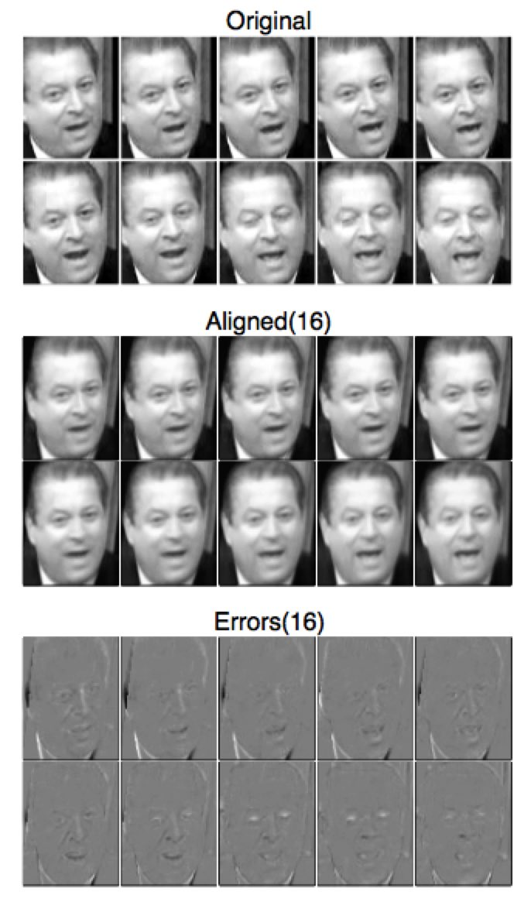
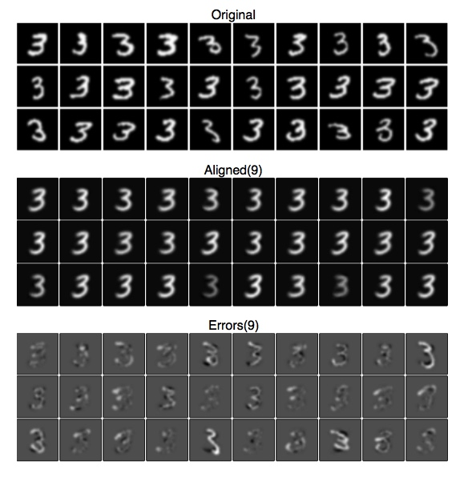

rasl
====
[![Build Status][travis-image]][travis-url] [![PyPI version][pypi-image]][pypi-url] [![PyPI download][download-image]][pypi-url]

Align linearly correlated images, possibly having gross corruption or occlusions.

`rasl` is a python implementation of the batch image alignment technique
described in:

    Y. Peng, A. Ganesh, J. Wright, W. Xu, Y. Ma,
    "Robust Alignment by Sparse and Low-rank Decomposition for
    Linearly Correlated Images", IEEE Transactions on Pattern
    Analysis and Machine Intelligence (PAMI) 2011

The paper describes a technique for aligning images of objects varying
in illumination and projection, possibly with occlusions (such as
facial images at varying angles, some including eyeglasses or
hair). RASL seeks transformations or deformations that will best
superimpose a batch of images, with pixel accuracy where possible. It
solves this problem by decomposing the image matrix into a dense
low-rank component (analogous to "eigenfaces" in face-recognition
literature) combined with a sparse error matrix representing any
occlusions. The decomposition is accomplished with a robust form of
PCA via Principal Components Pursuit.

Precise alignment like this is required by (or at least improves the
performance of) many different facial decomposition and recognition
algorithms. RASL is thus a useful preprocessing step for a training
set of images, rather than a complete facial
extraction/decomposition/recognition system.

The paper, the data used in the paper, and a reference MATLAB
implementation are available from the paper's authors at
http://perception.csl.illinois.edu/matrix-rank/rasl.html

(This python implementation is based on that MATLAB implementation but
is otherwise independent of its authors)

Quick Start
-----------
(PyPi wheels coming soon)

To install in-place so you can run tests and play with the included data sets:
```
> git clone git@github.com:welch/rasl.git
> cd rasl
> pip install -e .
> py.test -sv
.... (test output) ...
```

Examples
--------
You'll need to be in the toplevel rasl directory to run these. The
examples use image sets from the paper.

`> python examples/dummy.py`


The "Aligned" panel is the reconstructed low-rank component of the
image. Notice how the occusions have been removed. The "Error" panel
is the part of the image that is left over after the low-rank
component is removed.

`> python examples/gore.py`



Successive frames of Al Gore giving a speech. Bump up the --grid
option to see more frames (there are 140 of them). It is interesting
that Gore's closed eyes in frames 8-10 are deemed "occlusions", and
the restored frame in the Aligned panel gives him open eyes!

`> python examples/digits.py`



RASL is not just for faces. These are handwritten digits from the
MNIST database. They are aligned using only rotation and translation
(--euclidean), as in the paper. The other transformation types succeed
in aligning the digits, but then zoom out to infinity. I've not
determined if this is a flaw in the implementation or a natural
behavior of RASL as specified.

Built-in command: rasl.demo
---------------------------
The `rasl` package ships with a builtin shell command, `rasl.demo`,
that is installed when you install the package. It expects a path to a
directory of image files, and has many options (the python examples
above simply call rasl.demo with appropriate settings). One caveat: if
your images are of different sizes (as in the Al_Gore directory)
you'll need specify --crop to trim them all to the same size as they
load.


Dependencies
-------------
numpy, scipy, scikit-image

[travis-image]: https://travis-ci.org/welch/rasl.svg?branch=master
[travis-url]: https://travis-ci.org/welch/rasl
[pypi-image]: http://img.shields.io/pypi/v/rasl.svg
[download-image]: http://img.shields.io/pypi/dm/rasl.svg
[pypi-url]: https://pypi.python.org/pypi/rasl
